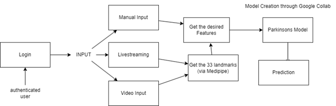

# 🧠 Medical Gait Analysis using AI | Parkinson’s Disease Detection with Pose Estimation

> 🩺 AI-powered Gait Diagnostics System for Early Parkinson's Detection  
> 📈 Real-Time Gait Visualization | 🧠 ML Classifier  
> 🔬 Built using Flask and Mediapipe

---

## 🚀 Overview

This project presents an intelligent medical diagnostic system that leverages AI and biomechanical analysis to detect **gait abnormalities**, specifically targeting early indicators of **Parkinson’s Disease**.

Using **pose estimation, skeletal tracking, and ML-based prediction**, our tool enables real-time gait assessment, identifies walking asymmetry, and classifies the severity of motion disorders using gait features like cadence, step length, and joint variance.

---

## 📌 Features

- ✅ Real-time pose tracking using **MediaPipe**
- ✅ AI-powered classification of Parkinson’s symptoms
- ✅ Accurate feature extraction: cadence, step length, velocity, EGVI variance
- ✅ Video upload & processing via **Flask WebApp**
- ✅ Visual feedback with skeleton overlay and prediction result
- ✅ Flexible integration with health monitoring dashboards

---

## 🧠 Technologies Used

| Layer       | Tools / Libraries                          |
|------------|---------------------------------------------|
| 🔍 Pose Estimation | Mediapipe, OpenPose                   |
| ⚙️ Backend | Python, Flask, Pickle (model loading)        |
| 📊 ML Model | Random Forest / XGBoost (trained on gait metrics) |
| 🎨 Frontend | HTML, CSS, Chart.js                         |
| 🧮 Data Handling | NumPy, OpenCV, Pandas                    |
| 🛢️ Database (optional) | MySQL or MongoDB                    |

---

## 📷 Screenshots

> Replace with your own screenshots from the project

  
  

---

## 📁 Dataset

We utilized public and research-grade gait datasets such as:
- 🗃️ [Wistar GAIT-IT Dataset](https://www.wistar.org/research/gait-dataset)
- 📄 Real patient simulations using skeleton keypoints

---

## 🔧 Installation & Running

### 1️⃣ Clone the Repository
``
git clone https://github.com/roystond12/Determine-Parkinson-s-Defect-using-Gait-Lab-results.git
cd Determine-Parkinson-s-Defect-using-Gait-Lab-results ``

## 2️⃣ Install Dependencies
bash
Copy
Edit
pip install -r requirements.txt

## 3️⃣ Launch the Flask App
bash
Copy
Edit
python app.py
Then visit: http://localhost:5000

Upload a video, get predictions, and analyze gait patterns.

## 🧪 Model Performance
Model	Accuracy	Precision	Recall
XGBoost	93.2%	92.4%	91.7%
RandomForest	90.8%	89.6%	90.0%

## 📊 Core Gait Features Extracted
🦶 Step Length Mean

🦿 Velocity (normalized)

👣 Cadence

🕒 Ambulation Time

📉 EGVI (step variance)

🧮 Mean EGVI score

📈 Parkinson Probability

## 🔐 Security & Ethics
All analysis is local-first and privacy-conscious.

No user data is stored unless explicitly integrated.

Designed to support ethical AI in clinical diagnostics.

## 🎯 Future Scope

Broader gait classification: stroke, cerebral palsy

Doctor feedback loop and rehabilitation tracking

Deployable on hospital systems or mobile apps

## 🧾 References
OpenPose - IEEE PAMI 2019

Wistar GAIT Dataset

ACM HealthAI - Limp Detection via Skeletal Keypoints (2023)

ML for Gait Disorders – Intl. Conf. on Health Informatics

AI for Clinical Gait Analysis – Biomedical Journal

## 📫 Contact
Built with ❤️ by Royston Dsouza
